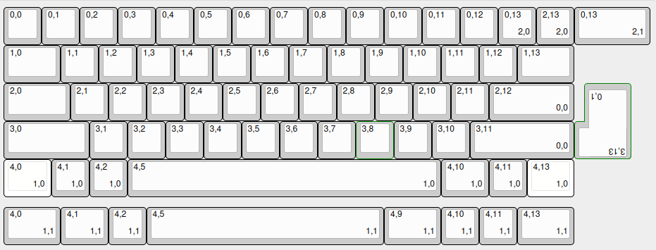
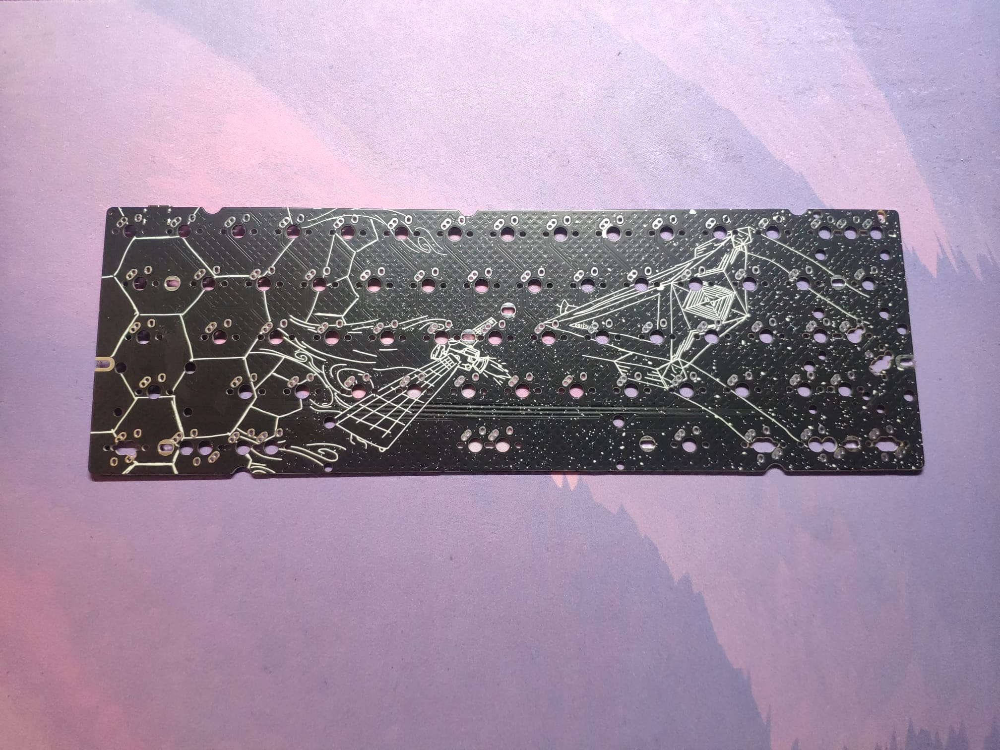
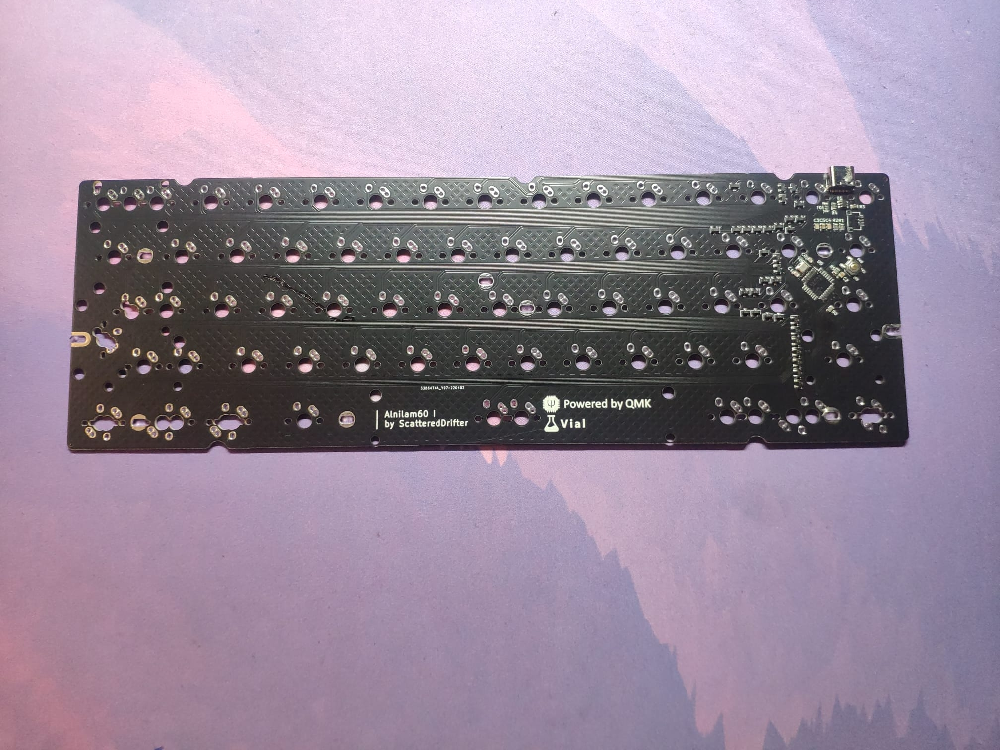

# Alnilam-60

typical plain-c with the twist of supporting Alps and a weird 8u, flipped Iso-Enter layout The outlines and mounting hole positions were taken from the [bakeneko60](https://github.com/kkatano/bakeneko-60) and [Plain-C](https://github.com/evyd13/plain60-c) 
--- 
### Current Status: Prototypes arrived; fully tested and working 

- Case Design in Progress // not tested 

---

## Alnilam-60:

the compromise of 65% and 50% keyboards within my  three-board-series named after the three bright stars forming the omnipresent orion belt you can perceive within the night. While it is your normal 60% keyboard with ALPS-support, it also features a unique, trash-layout which is only useable, if you own a flipped ISO-Enter key, and 8u spacebar, thats why it exists.

If you wish to order your own pcb and case, you can find all the necessary files within this repository 

---

## Features:

- Pinouts for additional WSB28 / SK61 Leds ( have to be implement in firmware afterwards)

- some layout options

- pcb-outlines support the use of a bakeneko60 case 

- jst-connector implemented, supporting the use of the unified daughterboard **C3** 

- mounting holes for typical tray-mount cases ** not tested yet **

- Supports both alps and mx-style switches 

---

## Images:

